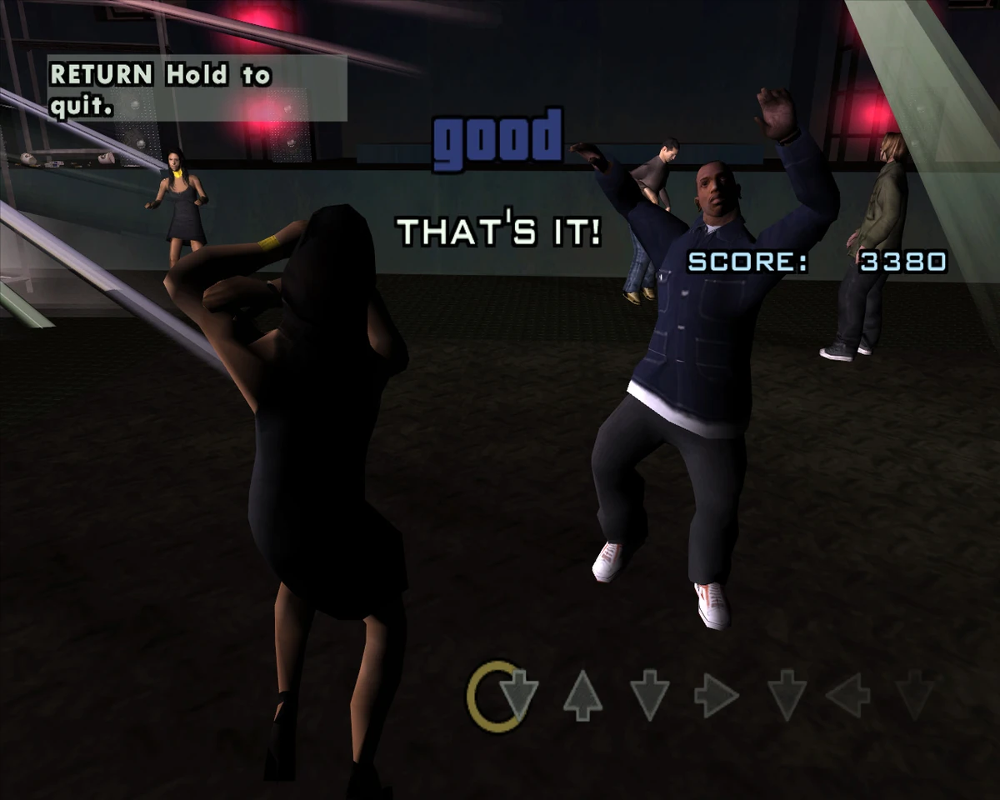
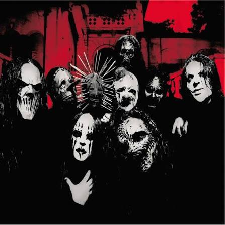

# Ritmo Setas

Projeto desenvolvido em **React**, **TypeScript** e **SCSS** com o objetivo de recriar, na web, o minigame de ritmo presente em **Grand Theft Auto: San Andreas**.

> **Status:** Projeto demonstrativo (não finalizado).

## Sobre

A ideia deste projeto foi reproduzir a mecânica do jogo de ritmo do GTA San Andreas utilizando tecnologias web. Apesar de ainda não estar 100% funcional, o projeto demonstra boa parte da lógica implementada para sincronização das notas, leitura de inputs e renderização em tempo real.

Grande parte dos cálculos matemáticos utilizados para a lógica do jogo contou com auxílio do **ChatGPT**, enquanto toda a implementação e adaptação para o projeto foram desenvolvidas por mim.

## Tecnologias

- React
- TypeScript
- SCSS

## Como executar

Clone o repositório:

```bash
git clone <url-do-repositorio>
```

Instale as dependências:

```bash
npm install
```

Inicie o projeto:

```bash
npm run dev
```

## Música utilizada

Durante o desenvolvimento foi utilizada a música:

**Slipknot – The Blister Exists**

> A música é utilizada apenas para fins demonstrativos neste projeto pessoal, sem finalidade comercial.

## Imagens

### Referência do jogo



### Capa do álbum



### Projeto em funcionamento


## Observações

Este projeto foi desenvolvido com o intuito de estudo e demonstração de conhecimentos em React, TypeScript e manipulação de lógica de jogos em ambiente web. Não possui objetivo de produção ou distribuição comercial.
